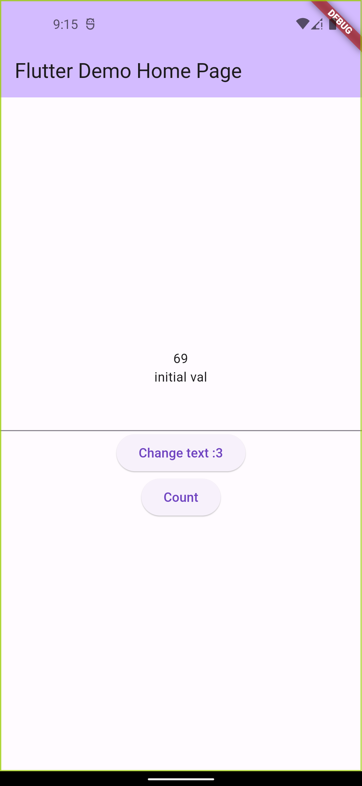
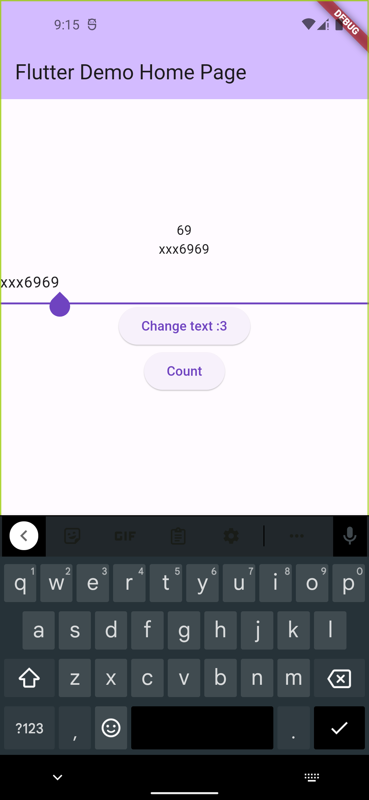
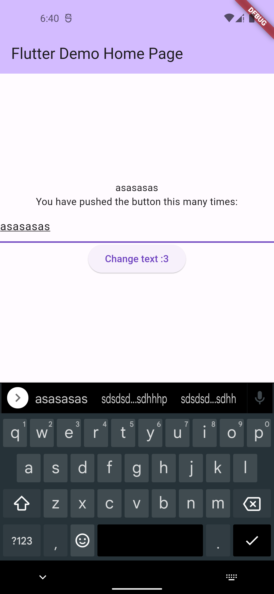

# _t04_provider

A new Flutter project.

## Getting Started

## Provider
- Gives us ChangeNotifier class that manages the state.
- We just have to notifyListeners() when we want to update the UI.
- From View end, we can either watch (to listen, gives us a listener) or read (to call a method from, gives us the access to the instance). 

## Screenshots

 
 
 
